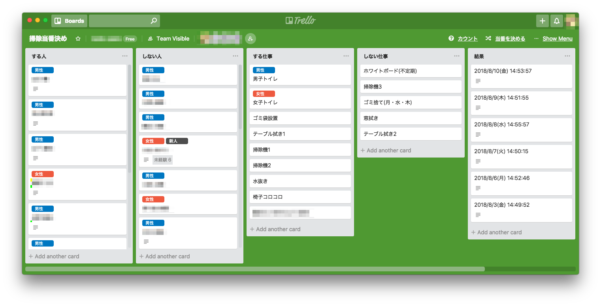

# hawaku-trello

> 掃除当番決めツール on Trello

関係者向けの掃除当番決めツールです。
Trello のチーム内限定 Power-Up として運用しています。

## 機能

- 履歴に基づいて、できるだけ公平に掃除当番を決めます
- 新人のカードに、未経験の仕事をラベルとして表示します

## 使い方

### 掃除当番決め

1.  「する人」リストに掃除を行う人のカードを、「する仕事」に行う掃除のカードを移動させます
2.  ボード右上「当番を決める」ボタンを押下すると、「結果」リストに当番の割当カードが追加され、そのカードが開かれます

### 未経験仕事の表示

1.  表示させたい人のカードに「新人」ラベルを付けます
2.  経験した仕事は、人カードを開いて「手伝いを記録する」ボタンから記録することで、表示を消去できます

## 仕組み

- カードの説明の中にデータを JSON として埋め込んで保存しています
  - 「人」リストのカード：その人が行った仕事の数（種類別）
  - 「結果」リストのカード：掃除当番（人 - 仕事ペア）の割当
  - 夜中に「結果」リストの追加分を「人」リストのカードに反映させています
- 当番を決めるときには、「する仕事」の上から順に、その仕事を行った割合が低い「する人」を割り当てます
  - 「男性」・「女性」ラベルの付いた仕事には、それぞれ同じラベルの付いた人を割り当てます

## 実行環境

- Power-Up ホスティング：Netlify
- バッチ処理：Google Apps Script

## License

MIT

Icons by [Font Awesome](https://fontawesome.com/) / [CC BY](https://fontawesome.com/license/free)
